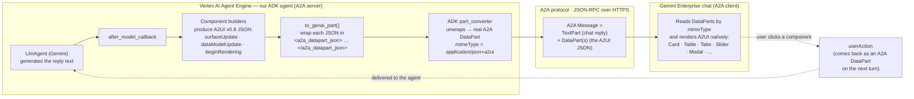

# A2UI Advanced — Restaurant Concierge

A **stateful, multi-step** A2UI use case for Gemini Enterprise, in contrast to the
component gallery (which shows one component per turn). The concierge combines many
components into a single guided flow to book a restaurant table.

```
preferences ──▶ results ──▶ detail ──▶ reservation ──▶ confirmation
```

| Step | Components combined |
|---|---|
| **Preferences** | 2× MultipleChoice (cuisine, dietary) · Slider (budget) · DateTimeInput · Button |
| **Results** | filtered restaurant rows (Row/Column/Text) · a Select button per row |
| **Detail** | Tabs: Overview · Menu (dish list) · Reviews (+ References modal) · Location · Reserve/Back |
| **Reservation** | Form (TextField ×2) · Slider (party size) · DateTimeInput · Confirm |
| **Confirmation** | booking summary built from state · New-search |

## How it works
- **State** lives in the ADK session state (`booking` dict + `step`). Every button is
  a named `userAction`; `agent.advance()` is a pure transition that updates the booking
  and returns the next step. The `after_model_callback` persists it and renders that
  step's A2UI components. The LLM's text is replaced with step copy — the flow is fully
  deterministic, not LLM-dependent.
- **Reuses the gallery's lessons**: flat single-segment data-model paths, history
  scrubbing (so the model can't echo A2UI JSON into chat), and the `<a2a_datapart_json>`
  transport (`agent/a2ui.py`, copied verbatim).
- **No images** — GE cannot render them (see `../resolution.md`).

## How A2UI is rendered in Gemini Enterprise — A2A, not raw JSON

> **Q: Are we using A2A, or just sending JSON?**
> **A: Both — the *content* is A2UI JSON, and the *transport* is the A2A protocol.**
> The UI is described as A2UI v0.8 **JSON**, but it is **not** sent as raw JSON/text in the
> chat. Each JSON message is carried as a structured **A2A `DataPart`** (metadata
> `mimeType = application/json+a2ui`) inside an **A2A Message**, over the **A2A
> (Agent-to-Agent) protocol**. Gemini Enterprise is the **A2A client**; our agent on
> Vertex AI Agent Engine is the **A2A server**. GE identifies A2UI DataParts by their
> mimeType and renders them natively — no frontend code.



**Why the tag wrapper?** ADK agent code can't emit a raw A2A `DataPart` directly, so we
wrap the A2UI JSON in a `<a2a_datapart_json>…</a2a_datapart_json>` text blob; ADK's
`part_converter` turns that into a genuine A2A DataPart on the wire (see
`agent/a2ui.py` → `to_genai_part()`). Emitting the JSON as a plain string instead would
just show raw text in chat — the DataPart + mimeType is what makes GE render it as UI.

**Round trip:** the agent sends A2UI DataParts → GE renders them → a button click returns
a `userAction` (also an A2A DataPart) → the agent's callback dispatches it. No polling, no
custom frontend, no webhooks — it's all the A2A message exchange.

## Layout
```
A2UI_advanced/
  agent/
    a2ui.py        reused transport/helpers (verbatim from the gallery)
    data.py        invented restaurant dataset + search filter
    concierge.py   the 5 step builders
    gallery.py     component-reference branch ("show me the components")
    agent.py       LlmAgent + state machine (advance) + callbacks
  tests/test_flow.py   37 offline tests (no LLM/network)
  deploy_to_agent_engine.py, requirements.txt, env.dev.example, starter_prompt.json
```

## Run tests
```bash
cd A2UI_advanced
../.venv/Scripts/python -m pytest tests/ -v
```

## Deploy
1. `cp env.dev.example .env.dev` and fill in project/bucket. **Keep the distinct
   `AGENT_DISPLAY_NAME`** — deploy matches create-or-update by display name, so a shared
   name would overwrite the gallery agent.
2. `python deploy_to_agent_engine.py`
3. Register the printed resource name in the GE Admin console (first deploy only).
